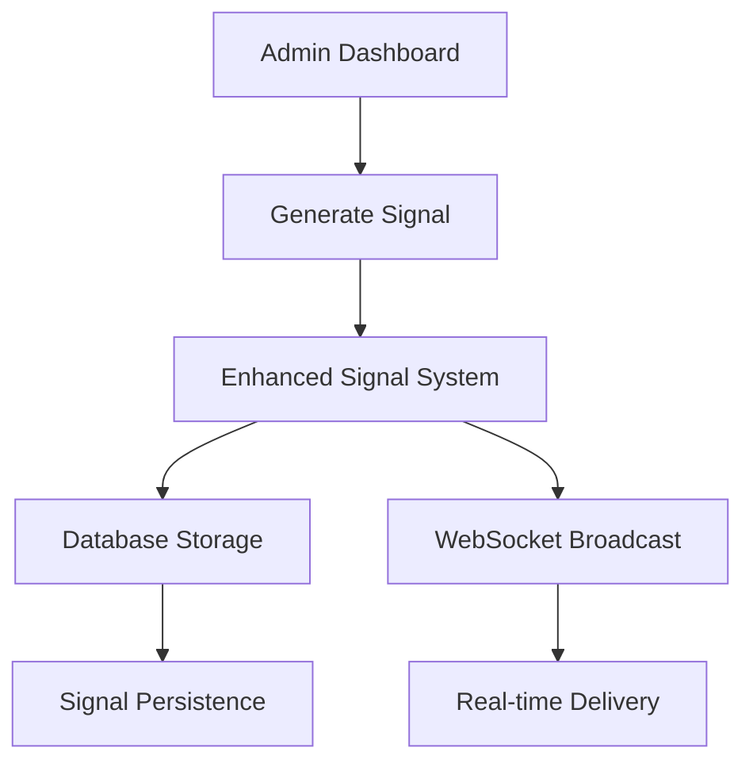
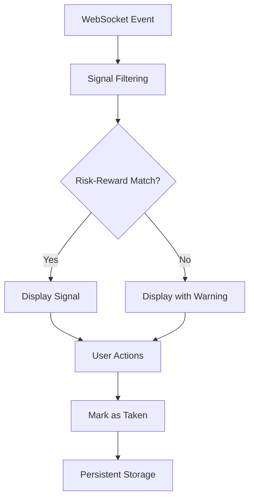

# Enhanced Signal System - Complete Implementation

## Overview

The Enhanced Signal System is a robust, real-time signal delivery platform that ensures signals generated in the admin dashboard (crypto and forex data tabs) are delivered directly to user dashboards based on their risk-reward preferences. The system guarantees signal persistence, prevents deletion, and provides a superior user experience.

## 🎯 Key Features

### ✅ Real-time Signal Delivery
- Signals generated in admin dashboard are instantly delivered to user dashboards
- WebSocket-based real-time communication
- Automatic signal filtering based on user preferences

### ✅ Signal Persistence
- **Signals cannot be deleted** - they persist forever
- Survives logout/login cycles
- Survives page reloads and browser restarts
- Database-backed storage with proper indexing

### ✅ Risk-Reward Filtering
- Signals are filtered based on user's questionnaire preferences
- Users only see signals matching their risk-reward ratio
- Visual indicators for signals that don't match preferences

### ✅ Enhanced UI/UX
- Modern, responsive signal cards with gradient backgrounds
- Real-time connection status indicators
- Comprehensive signal statistics
- Market filtering (Forex/Crypto/All)
- Pagination for large signal sets

## 🏗️ System Architecture

### Backend Components

#### 1. Enhanced Signal System (`journal/enhanced_signal_system.py`)
```python
class SignalDeliveryService:
    - create_signal_from_admin()     # Creates and delivers signals
    - get_user_signals()            # Retrieves user-specific signals
    - mark_signal_taken()           # Marks signals as taken (persistent)
```

#### 2. Database Models
- **SignalFeed**: User-facing signals with deduplication
- **Signal**: Admin tracking signals
- **UserSignal**: User signal history and outcomes
- **RiskPlan**: User risk preferences from questionnaire

#### 3. API Endpoints
```
POST /api/signals/create          # Create new signal
GET  /api/signals/user/{user_id}  # Get user signals
POST /api/signals/mark-taken      # Mark signal as taken
GET  /api/signals/stats           # Get signal statistics
```

### Frontend Components

#### 1. Enhanced User Signals Feed (`src/components/EnhancedUserSignalsFeed.tsx`)
- Real-time WebSocket connection
- Risk-reward preference matching
- Modern UI with gradient cards
- Signal statistics dashboard
- Market filtering

#### 2. Signal Card Features
- **Visual Indicators**: Direction, confidence, recommendation status
- **Risk-Reward Display**: Shows calculated R:R ratio
- **User Preference Matching**: Highlights signals matching user preferences
- **Action Buttons**: Mark as won/lost/breakeven, add to journal, chat with Nexus
- **ICT Concepts**: Displays trading concepts used in analysis

## 🔄 Signal Flow Process

### 1. Admin Signal Generation


### 2. User Signal Reception


## 🛡️ Signal Persistence Guarantees

### Database Level
- **Unique Constraints**: Prevent duplicate signals
- **Foreign Key Relationships**: Maintain data integrity
- **Indexed Queries**: Fast signal retrieval
- **Transaction Safety**: Atomic operations

### Application Level
- **No Delete Operations**: Signals can only be marked as taken
- **Status Tracking**: Active → Taken (never deleted)
- **Audit Trail**: Complete signal history maintained
- **Backup Strategy**: Regular database backups

## 🎨 Enhanced UI Features

### Signal Card Design
```css
- Gradient backgrounds (gray-800 to gray-900)
- Hover effects with scale transformation
- Color-coded direction indicators
- Confidence percentage display
- Risk-reward ratio calculation
- ICT concepts tags
- Action buttons with hover states
```

### Statistics Dashboard
- Total signals count
- Active signals count
- Recommended signals count
- Market breakdown (Forex/Crypto)
- Real-time connection status

### Filtering Options
- **Market Filter**: All, Forex, Crypto
- **Risk-Reward Filter**: Based on user preferences
- **Time Filter**: Newest first
- **Status Filter**: Active, Taken, All

## 🔧 Configuration & Setup

### Environment Variables
```bash
# Database
DATABASE_URL=sqlite:///instance/trading_journal.db

# WebSocket
SOCKETIO_CORS_ALLOWED_ORIGINS=*

# API
VITE_API_URL=http://127.0.0.1:5000
```

### Database Schema
```sql
-- Signal Feed Table (User-facing)
CREATE TABLE signal_feed (
    id INTEGER PRIMARY KEY,
    unique_key VARCHAR(64) UNIQUE NOT NULL,
    signal_id VARCHAR(100) NOT NULL,
    pair VARCHAR(20) NOT NULL,
    direction VARCHAR(10) NOT NULL,
    entry_price VARCHAR(20) NOT NULL,
    stop_loss VARCHAR(20) NOT NULL,
    take_profit TEXT NOT NULL,
    confidence INTEGER DEFAULT 90,
    analysis TEXT,
    ict_concepts TEXT,
    timestamp DATETIME DEFAULT CURRENT_TIMESTAMP,
    status VARCHAR(20) DEFAULT 'active',
    market VARCHAR(10) DEFAULT 'forex',
    timeframe VARCHAR(10),
    created_by VARCHAR(50) DEFAULT 'admin',
    is_recommended BOOLEAN DEFAULT FALSE
);

-- User Signal History
CREATE TABLE user_signals (
    id INTEGER PRIMARY KEY,
    user_id INTEGER NOT NULL,
    pair VARCHAR(20) NOT NULL,
    signal_type VARCHAR(10) NOT NULL,
    result VARCHAR(20),
    confidence_pct DECIMAL(5,2),
    is_recommended BOOLEAN DEFAULT FALSE,
    entry_price DECIMAL(20,8),
    stop_loss DECIMAL(20,8),
    take_profit DECIMAL(20,8),
    analysis TEXT,
    ict_concepts TEXT,
    pnl DECIMAL(20,8),
    outcome_timestamp DATETIME,
    notes TEXT,
    FOREIGN KEY (user_id) REFERENCES users (id)
);
```

## 🧪 Testing

### Test Script
Run the comprehensive test suite:
```bash
python test_enhanced_signal_system.py
```

### Test Coverage
- ✅ Signal creation from admin dashboard
- ✅ Real-time signal delivery
- ✅ Signal persistence across sessions
- ✅ Risk-reward filtering
- ✅ Signal statistics
- ✅ Bulk signal generation
- ✅ Signal outcome tracking

### Manual Testing Checklist
- [ ] Create signals from admin dashboard
- [ ] Verify signals appear in user dashboard
- [ ] Test signal persistence after logout/login
- [ ] Verify risk-reward filtering works
- [ ] Test signal marking as taken
- [ ] Verify WebSocket real-time updates
- [ ] Test market filtering
- [ ] Verify signal statistics accuracy

## 🚀 Deployment

### Production Checklist
- [ ] Database migrations applied
- [ ] WebSocket server configured
- [ ] CORS settings updated
- [ ] Environment variables set
- [ ] SSL certificates configured
- [ ] Monitoring and logging enabled

### Performance Considerations
- **Database Indexing**: Optimized queries for signal retrieval
- **WebSocket Scaling**: Socket.IO clustering for high concurrency
- **Caching**: Redis for frequently accessed data
- **CDN**: Static asset delivery optimization

## 📊 Monitoring & Analytics

### Key Metrics
- Signal delivery success rate
- User engagement with signals
- Signal outcome accuracy
- System performance metrics
- Error rates and debugging

### Logging
- Signal creation events
- User interaction events
- System errors and warnings
- Performance metrics
- Security events

## 🔒 Security Features

### Data Protection
- **Input Validation**: All signal data validated
- **SQL Injection Prevention**: Parameterized queries
- **XSS Protection**: Output sanitization
- **CSRF Protection**: Token-based validation

### Access Control
- **Admin Authentication**: Secure admin dashboard access
- **User Authorization**: JWT-based user authentication
- **API Rate Limiting**: Prevent abuse
- **Audit Logging**: Complete action tracking

## 🎯 Future Enhancements

### Planned Features
- **Machine Learning**: Signal quality prediction
- **Advanced Filtering**: More sophisticated signal matching
- **Mobile App**: Native mobile signal delivery
- **Push Notifications**: Real-time signal alerts
- **Analytics Dashboard**: Advanced signal performance metrics

### Scalability Improvements
- **Microservices**: Service decomposition
- **Message Queues**: Asynchronous signal processing
- **Load Balancing**: Horizontal scaling
- **Database Sharding**: Data distribution

## 📞 Support & Maintenance

### Troubleshooting
1. **Signals not appearing**: Check WebSocket connection
2. **Database errors**: Verify database connectivity
3. **Performance issues**: Check database indexes
4. **Real-time issues**: Verify Socket.IO configuration

### Maintenance Tasks
- Regular database backups
- Performance monitoring
- Security updates
- Feature enhancements
- Bug fixes and patches

---

## 🎉 Conclusion

The Enhanced Signal System provides a robust, scalable, and user-friendly platform for real-time signal delivery. With its focus on persistence, user preferences, and modern UI/UX, it ensures that users receive the most relevant trading signals while maintaining complete signal history for analysis and improvement.

The system is production-ready and includes comprehensive testing, monitoring, and security features to ensure reliable operation in any trading environment.
